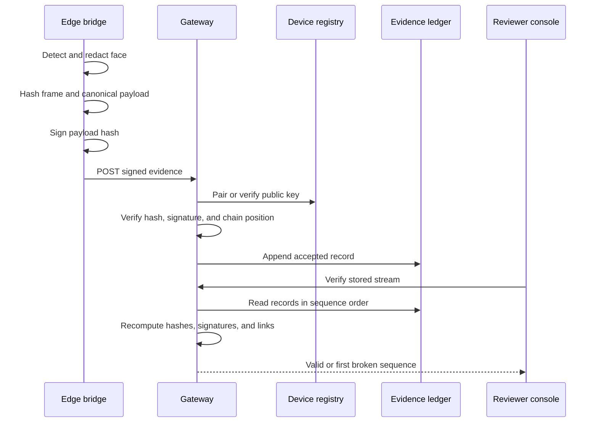

# AegisEye Core Architecture

## System Claim

AegisEye proves that visual evidence can be privacy-redacted near capture and later checked for origin, modification, reordering, or deletion.

```mermaid
flowchart LR
    A["Webcam or video"] --> B["OpenCV edge redaction"]
    B --> C["Redacted frame hash"]
    C --> D["Canonical evidence payload"]
    D --> E["SHA-256 payload hash"]
    E --> F["Ed25519 device signature"]
    F --> G["Spring Boot ingestion"]
    G --> H["PostgreSQL ledger"]
    H --> I["Chain verifier"]
    I --> J["Integrity console"]
```



## Components

### Edge Bridge

Location: `edge/aegis-eye-bridge`

Responsibilities:

- Open a webcam or video file.
- Detect faces with OpenCV Haar cascade.
- Blur detected regions before output or transmission metadata is created.
- Hash the encoded redacted frame.
- Build a deterministic JSON evidence payload.
- Link each payload to the prior payload hash.
- Sign the payload hash with a persistent Ed25519 key.
- Submit records and retain a local JSONL manifest.

The private key stays on the edge filesystem. The prototype never sends it to the backend.

### Gateway and Ledger

Location: `backend/aegis-gateway-hub`

Responsibilities:

- Pair the first accepted demo public key to the registered device.
- Recompute and compare the canonical payload hash.
- Verify the Ed25519 signature.
- Enforce genesis, sequence, and previous-hash continuity.
- Persist accepted records in PostgreSQL.
- Re-read stored rows and independently verify the complete chain.
- Report the first broken sequence and human-readable reason.

The gateway and ledger are one deployable service for the hackathon prototype. They can be separated after the contracts and operational requirements stabilize.

### Evidence Console

Location: `backend/aegis-gateway-hub/src/main/resources/static`

Responsibilities:

- Show known streams and evidence counts.
- List sequence, hashes, detections, model, and verification state.
- Trigger full chain verification.
- Run a controlled post-storage mutation only on `demo-*` streams.
- Show valid, pending, or broken status and the affected sequence.

### PostgreSQL

Key tables:

- `edge_device`: registered identity, status, key ID, paired public key, pairing time.
- `evidence_ledger`: payload, hashes, signature, sequence, timestamps, and verification result.

Unique constraints prevent duplicate stream sequences and duplicate payload hashes.

## Evidence Sequence



## Canonicalization Rule

Both Python and Java recursively sort object keys, preserve array order, emit compact UTF-8 JSON, and hash the resulting bytes with SHA-256. Cross-language canonicalization is a critical contract and should later be replaced or formally aligned with a standard such as RFC 8785 before production claims.

## Security Boundaries

```text
untrusted scene -> trusted edge process -> untrusted network -> validating gateway
-> mutable database -> independent verifier -> reviewer
```

The database is deliberately treated as mutable. Verification does not trust its stored `verification_status`; it recomputes the trust result from payload content, chain links, signatures, and the paired public key.

## Hackathon Tradeoffs

- Haar detection is lightweight and explainable but less accurate than modern detectors.
- The first demo key uses trust-on-first-use pairing rather than an authenticated enrollment ceremony.
- Local filesystem key custody is not hardware-backed.
- PostgreSQL is append-oriented by application behavior, not physically immutable.
- The controlled tamper API is enabled for local demo streams and must be disabled outside demo mode.
- Redacted video is local to the edge; the ledger stores integrity metadata, not media blobs.

These choices make the core idea buildable and demonstrable without overstating production readiness.
